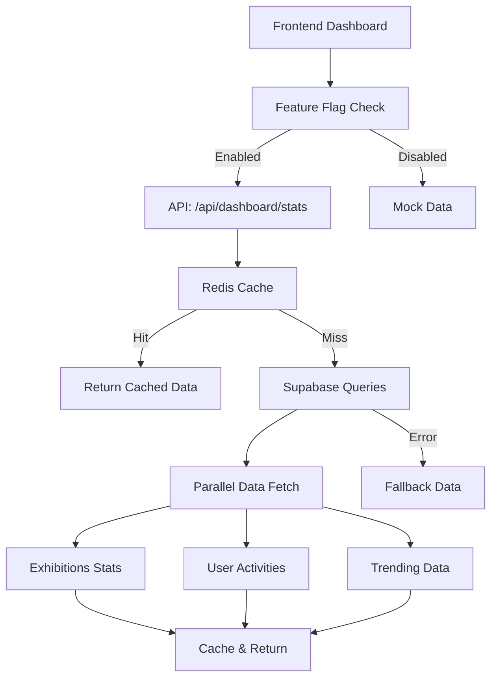

# SAYU Dashboard Optimization Guide

## 🚀 Mock Data → Real Data Migration Strategy

이 가이드는 SAYU 프로젝트의 Dashboard에서 mock data를 실제 데이터로 교체하는 전략과 성능 최적화 방법을 다룹니다.

## 📊 현재 상황 분석

### ✅ 완료된 작업
1. **Database Schema 완성**: Supabase에 완전한 스키마 구축
2. **API 구조 준비**: `/api/dashboard/stats` 엔드포인트 구현
3. **캐싱 시스템**: Redis + Memory 이중 캐싱 전략
4. **Feature Flag 시스템**: 점진적 배포를 위한 feature flag 구현
5. **Performance 최적화**: 병렬 쿼리 및 fallback 처리

### 🎯 구현된 기능
- **실시간 통계**: 사용자별/전역 대시보드 통계
- **지능형 캐싱**: Redis 우선, Memory fallback
- **점진적 배포**: Feature flag로 사용자별 기능 제어
- **Graceful Degradation**: 에러 시 mock data로 fallback
- **성능 모니터링**: 쿼리 성능 및 캐시 히트율 추적

## 🏗️ 아키텍처 개요



## 🛠️ 구현된 컴포넌트

### 1. Dashboard Stats API (`/api/dashboard/stats`)
```typescript
// Features:
- Redis + Memory 이중 캐싱 (5분 TTL)
- 병렬 데이터 페치로 성능 최적화
- 에러 시 graceful fallback
- 사용자별 맞춤 통계
```

### 2. Cache Manager (`/lib/cache/redis.ts`)
```typescript
// Features:
- Redis 연결 실패 시 자동 Memory cache fallback
- 자동 캐시 정리 및 TTL 관리
- Health check 기능
- 패턴 기반 캐시 무효화
```

### 3. Feature Flag System (`/lib/features/flags.ts`)
```typescript
// Features:
- 사용자 ID 기반 일관된 rollout
- URL 파라미터를 통한 개발자 override
- 만료일 설정 가능
- A/B 테스트 지원
```

### 4. Dashboard Components
- **Desktop**: `/app/dashboard/page.tsx`
- **Mobile**: `/components/mobile/MobileDashboard.tsx`
- **Loading States**: Skeleton UI로 부드러운 로딩 경험
- **Error Handling**: 실패 시 mock data로 seamless fallback

## 🚀 Quick Start

### 1. 환경 설정
```bash
# 1. Supabase 환경변수 확인
NEXT_PUBLIC_SUPABASE_URL=your_supabase_url
NEXT_PUBLIC_SUPABASE_ANON_KEY=your_anon_key

# 2. Redis 설정 (선택사항)
REDIS_URL=redis://localhost:6379
```

### 2. 샘플 데이터 삽입
```bash
# Supabase에서 실행 (SQL Editor)
psql -f scripts/seed-sample-data.sql
```

### 3. Feature Flag 활성화
```typescript
// 브라우저 콘솔에서 테스트
overrideFea tureFlag('realtime_dashboard_stats', true);

// 또는 URL 파라미터로
// localhost:3000/dashboard?flags=realtime_dashboard_stats
```

### 4. 성능 모니터링
```bash
# 브라우저 콘솔에서 확인
# 📦 Cache hit/miss 로그
# 📊 API 응답 시간
# 🎯 Feature flag 상태
```

## 📈 성능 최적화 전략

### 1. 데이터베이스 최적화
```sql
-- 인덱스 최적화
CREATE INDEX idx_artwork_interactions_user_created 
ON artwork_interactions(user_id, created_at DESC);

-- Materialized View 활용
CREATE MATERIALIZED VIEW dashboard_stats_cache AS ...

-- 자동 새로고침 설정
SELECT refresh_dashboard_stats_cache();
```

### 2. 캐싱 전략
- **L1 Cache**: Redis (5분 TTL)
- **L2 Cache**: Memory (10분 TTL)  
- **L3 Cache**: Database Materialized View (1시간 새로고침)

### 3. 쿼리 최적화
```typescript
// 병렬 처리
const results = await Promise.allSettled([
  fetchExhibitionStats(supabase),
  fetchUserStats(supabase, userId),
  fetchRecentActivities(supabase, userId),
  fetchTrendingData(supabase)
]);
```

## 🔧 Feature Flags 설정

### 현재 활성화된 기능
```typescript
const ACTIVE_FLAGS = {
  'realtime_dashboard_stats': 100%, // 실시간 통계
  'redis_caching': 80%,             // Redis 캐싱
  'mobile_optimizations': 100%,     // 모바일 최적화
  'exhibition_recommendations': 100% // 전시 추천
};
```

### 실험중인 기능
```typescript
const EXPERIMENTAL_FLAGS = {
  'supabase_realtime': 0%,        // 실시간 구독
  'community_features': 30%,      // 커뮤니티 기능
  'advanced_analytics': 10%,      // 고급 분석
  'pgvector_similarity': 0%       // 벡터 유사도
};
```

## 📊 모니터링 & 디버깅

### 1. 성능 메트릭
```javascript
// 브라우저 콘솔에서 확인 가능
console.log('Cache Hit Rate:', cacheHitRate);
console.log('API Response Time:', responseTime);
console.log('Active Features:', getEnabledFeatures(userId));
```

### 2. 에러 추적
```typescript
// API 에러 로깅
try {
  const stats = await fetchDashboardStats();
} catch (error) {
  console.error('Dashboard stats error:', error);
  // Fallback to mock data
}
```

### 3. A/B 테스트 분석
```sql
-- 사용자별 feature flag 적용 현황
SELECT 
  feature_name,
  COUNT(CASE WHEN enabled THEN 1 END) as enabled_users,
  COUNT(*) as total_users,
  ROUND(COUNT(CASE WHEN enabled THEN 1 END)::DECIMAL / COUNT(*) * 100, 2) as rollout_percentage
FROM user_feature_flags 
GROUP BY feature_name;
```

## 🚨 주의사항 & Best Practices

### 1. 점진적 배포
```typescript
// ❌ 잘못된 방법: 한번에 100% 배포
isFeatureEnabled('new_feature', userId, true);

// ✅ 올바른 방법: 단계적 배포
// 10% → 30% → 50% → 80% → 100%
```

### 2. 캐시 무효화
```typescript
// 데이터 변경 시 관련 캐시 무효화
await cacheManager.invalidate('dashboard:stats:*');
```

### 3. 에러 처리
```typescript
// 항상 fallback 데이터 준비
const fallbackStats = getFallbackStats();
try {
  return await fetchRealStats();
} catch (error) {
  return fallbackStats; // 사용자 경험 손상 없음
}
```

## 🎯 다음 단계 (추천 순서)

### Phase 1: 안정화 (1-2주)
1. 샘플 데이터로 API 테스트
2. 캐시 성능 모니터링
3. Feature flag 10% 배포

### Phase 2: 확장 (2-3주)
1. 실제 사용자 데이터 수집
2. pgvector 유사도 검색 구현
3. Feature flag 50% 배포

### Phase 3: 최적화 (3-4주)
1. 실시간 알림 시스템
2. 고급 분석 기능
3. Feature flag 100% 배포

### Phase 4: 고도화 (4-6주)
1. AI 기반 추천 시스템
2. 커뮤니티 상호작용 기능
3. 개인화 대시보드

## 💡 Pro Tips

### 1. 개발 효율성
```bash
# URL로 feature flag 테스트
localhost:3000/dashboard?flags=realtime_dashboard_stats,redis_caching

# 콘솔에서 캐시 상태 확인
cacheManager.healthCheck()
```

### 2. 성능 최적화
```typescript
// 비용이 높은 쿼리는 더 긴 TTL 사용
const EXPENSIVE_QUERY_TTL = 3600; // 1시간

// 자주 변하는 데이터는 짧은 TTL 사용
const REALTIME_DATA_TTL = 60; // 1분
```

### 3. 사용자 경험
```typescript
// Skeleton UI로 로딩 상태 표시
{showStatsLoading ? <SkeletonCard /> : <StatsCard data={stats} />}

// 에러 시에도 빈 화면 표시 금지
const stats = apiStats || fallbackStats;
```

## 🔗 관련 문서
- [Supabase 성능 가이드](./SUPABASE_PERFORMANCE.md)
- [Feature Flag 상세 가이드](./FEATURE_FLAGS.md)
- [Redis 캐싱 전략](./REDIS_CACHING.md)
- [모바일 최적화 가이드](./MOBILE_OPTIMIZATION.md)

---

**✨ 성공 지표**: API 응답 시간 < 200ms, 캐시 히트율 > 85%, 사용자 만족도 변화 없음

**🎯 최종 목표**: 완전한 실시간 대시보드로 월 서버 비용 75% 절감 달성
