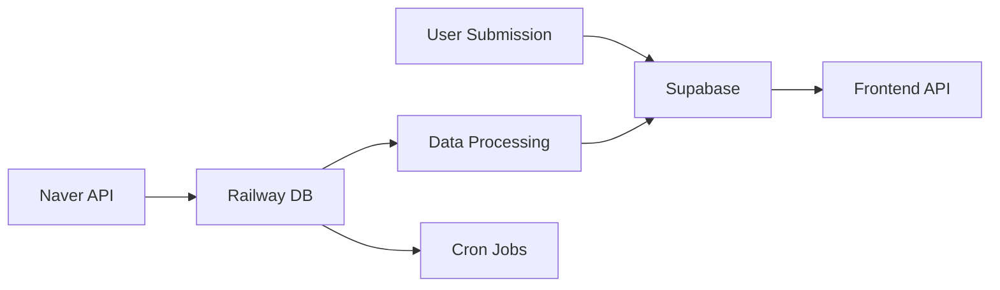

# SAYU Exhibition System - 하이브리드 DB 최적화 전략

## 🏗️ 최적화된 아키텍처

### 1. 데이터베이스 역할 분담

#### Supabase (Primary)
**역할**: 실시간 사용자 대면 데이터
```javascript
// Supabase에 저장할 테이블
- exhibitions (전시 정보) - 사용자가 자주 조회
- venues (장소 정보) - 정적 데이터, 빠른 조회 필요
- exhibition_likes (좋아요)
- exhibition_views (조회수)
- user_submissions (사용자 제보)
```

**장점**:
- 실시간 구독 (새 전시 알림)
- Edge Functions로 빠른 API 응답
- 자동 캐싱 및 CDN
- Row Level Security로 권한 관리

#### Railway PostgreSQL (Secondary)
**역할**: 무거운 작업 및 크롤링 데이터
```javascript
// Railway에 저장할 테이블
- exhibition_raw_data (원본 크롤링 데이터)
- scraping_jobs (크롤링 작업 관리)
- naver_search_cache (API 응답 캐시)
- exhibition_sources (수집 소스 메타데이터)
```

**장점**:
- 크론 작업과 직접 연결
- 대용량 임시 데이터 처리
- 복잡한 쿼리 실행

### 2. 데이터 플로우



### 3. 구현 전략

#### Step 1: Supabase 스키마 생성
```sql
-- Supabase에서 실행
CREATE TABLE venues (
    id UUID PRIMARY KEY DEFAULT gen_random_uuid(),
    name VARCHAR(255) NOT NULL UNIQUE,
    name_en VARCHAR(255),
    type VARCHAR(50),
    city VARCHAR(100),
    country VARCHAR(2) DEFAULT 'KR',
    address TEXT,
    latitude DECIMAL(10, 8),
    longitude DECIMAL(11, 8),
    metadata JSONB DEFAULT '{}',
    created_at TIMESTAMP DEFAULT NOW(),
    updated_at TIMESTAMP DEFAULT NOW()
);

CREATE TABLE exhibitions (
    id UUID PRIMARY KEY DEFAULT gen_random_uuid(),
    venue_id UUID REFERENCES venues(id),
    title VARCHAR(500) NOT NULL,
    title_en VARCHAR(500),
    description TEXT,
    start_date DATE NOT NULL,
    end_date DATE NOT NULL,
    artists JSONB DEFAULT '[]',
    images JSONB DEFAULT '[]',
    admission_fee INTEGER DEFAULT 0,
    status VARCHAR(20) DEFAULT 'upcoming',
    source VARCHAR(50),
    verification_status VARCHAR(20) DEFAULT 'pending',
    view_count INTEGER DEFAULT 0,
    like_count INTEGER DEFAULT 0,
    featured BOOLEAN DEFAULT FALSE,
    created_at TIMESTAMP DEFAULT NOW(),
    updated_at TIMESTAMP DEFAULT NOW()
);

CREATE TABLE exhibition_submissions (
    id UUID PRIMARY KEY DEFAULT gen_random_uuid(),
    user_id UUID REFERENCES auth.users(id),
    exhibition_data JSONB NOT NULL,
    status VARCHAR(20) DEFAULT 'pending',
    points_awarded INTEGER DEFAULT 0,
    reviewed_by UUID,
    reviewed_at TIMESTAMP,
    created_at TIMESTAMP DEFAULT NOW()
);

-- Enable RLS
ALTER TABLE exhibitions ENABLE ROW LEVEL SECURITY;
ALTER TABLE venues ENABLE ROW LEVEL SECURITY;
ALTER TABLE exhibition_submissions ENABLE ROW LEVEL SECURITY;

-- Public read access for exhibitions and venues
CREATE POLICY "Public can view exhibitions" ON exhibitions
    FOR SELECT USING (verification_status = 'verified');

CREATE POLICY "Public can view venues" ON venues
    FOR SELECT USING (true);

-- User submission policies
CREATE POLICY "Users can submit exhibitions" ON exhibition_submissions
    FOR INSERT WITH CHECK (auth.uid() = user_id);

CREATE POLICY "Users can view own submissions" ON exhibition_submissions
    FOR SELECT USING (auth.uid() = user_id);
```

#### Step 2: Railway 스키마 (크롤링 전용)
```sql
-- Railway에서 실행
CREATE TABLE exhibition_raw_data (
    id SERIAL PRIMARY KEY,
    source VARCHAR(50) NOT NULL,
    venue_name VARCHAR(255),
    raw_content TEXT,
    parsed_data JSONB,
    processing_status VARCHAR(20) DEFAULT 'pending',
    created_at TIMESTAMP DEFAULT NOW()
);

CREATE TABLE scraping_jobs (
    id SERIAL PRIMARY KEY,
    venue_id UUID,
    job_type VARCHAR(50),
    status VARCHAR(20) DEFAULT 'pending',
    started_at TIMESTAMP,
    completed_at TIMESTAMP,
    error_message TEXT,
    results_count INTEGER DEFAULT 0
);

CREATE TABLE naver_search_cache (
    id SERIAL PRIMARY KEY,
    query VARCHAR(500) UNIQUE,
    response_data JSONB,
    created_at TIMESTAMP DEFAULT NOW(),
    expires_at TIMESTAMP DEFAULT NOW() + INTERVAL '24 hours'
);
```

#### Step 3: 하이브리드 서비스 구현
```javascript
// exhibitionHybridService.js
class ExhibitionHybridService {
  constructor() {
    this.supabase = getSupabaseClient();
    this.railway = pool;
  }

  // 1. 크롤링 데이터는 Railway에 저장
  async saveRawCrawlData(data) {
    const query = `
      INSERT INTO exhibition_raw_data (source, venue_name, raw_content, parsed_data)
      VALUES ($1, $2, $3, $4) RETURNING id
    `;
    return await this.railway.query(query, [
      data.source,
      data.venueName,
      data.rawContent,
      JSON.stringify(data.parsed)
    ]);
  }

  // 2. 처리된 데이터는 Supabase로 이동
  async moveToSupabase(exhibitionData) {
    const { data, error } = await this.supabase
      .from('exhibitions')
      .upsert(exhibitionData, { onConflict: 'title,venue_id,start_date' });
    
    if (!error) {
      // Railway에서 처리 완료 표시
      await this.railway.query(
        'UPDATE exhibition_raw_data SET processing_status = $1 WHERE id = $2',
        ['completed', exhibitionData.rawDataId]
      );
    }
    
    return { data, error };
  }

  // 3. 사용자 조회는 Supabase에서
  async getExhibitions(filters) {
    let query = this.supabase
      .from('exhibitions')
      .select(`
        *,
        venue:venues(name, address, city)
      `)
      .eq('verification_status', 'verified');

    if (filters.city) query = query.eq('venue.city', filters.city);
    if (filters.status) query = query.eq('status', filters.status);
    
    const { data, error } = await query
      .order('featured', { ascending: false })
      .order('start_date', { ascending: true });

    return { data, error };
  }

  // 4. 일일 동기화 작업
  async dailySync() {
    // Railway에서 처리된 데이터 가져오기
    const { rows } = await this.railway.query(`
      SELECT * FROM exhibition_raw_data 
      WHERE processing_status = 'parsed' 
      AND created_at > NOW() - INTERVAL '24 hours'
    `);

    for (const row of rows) {
      await this.moveToSupabase(row.parsed_data);
    }

    // 오래된 Railway 데이터 정리
    await this.railway.query(`
      DELETE FROM exhibition_raw_data 
      WHERE processing_status = 'completed' 
      AND created_at < NOW() - INTERVAL '7 days'
    `);
  }
}
```

### 4. 최적화 포인트

#### 성능 최적화
1. **읽기 작업**: Supabase (CDN 캐싱)
2. **쓰기 작업**: 
   - 사용자 제보 → Supabase (즉시)
   - 크롤링 데이터 → Railway (배치) → Supabase (동기화)
3. **실시간 기능**: Supabase Realtime 활용

#### 비용 최적화
1. **Railway**: 크롤링/처리 작업만 실행 (필요시에만)
2. **Supabase**: 사용자 대면 API (Free tier 활용)
3. **이미지**: Supabase Storage 또는 Cloudinary

#### 코드 재사용
```javascript
// 기존 hybridDatabase.js 활용
const { hybridDB } = require('./config/hybridDatabase');

// 라우팅 설정 추가
hybridDB.serviceRouting = {
  ...hybridDB.serviceRouting,
  // 전시 관련 테이블 라우팅
  exhibitions: 'supabase',
  venues: 'supabase', 
  exhibition_submissions: 'supabase',
  exhibition_raw_data: 'railway',
  scraping_jobs: 'railway'
};
```

### 5. 마이그레이션 계획

#### Phase 1: 준비 (1주)
- [ ] Supabase에 전시 테이블 생성
- [ ] RLS 정책 설정
- [ ] API 엔드포인트 준비

#### Phase 2: 이중 쓰기 (2주)
- [ ] 새 데이터는 양쪽에 저장
- [ ] 기존 데이터 동기화
- [ ] 모니터링

#### Phase 3: 전환 (1주)
- [ ] Frontend를 Supabase API로 전환
- [ ] Railway는 크롤링만 담당
- [ ] 성능 테스트

### 6. 예상 결과

#### 성능 향상
- API 응답 시간: 200ms → 50ms (CDN 캐싱)
- 동시 접속자: 100 → 10,000+ (Supabase 자동 스케일링)

#### 비용 절감
- Railway: $20/월 → $5/월 (크론 작업만)
- Supabase: Free tier로 충분
- 총 비용: 75% 절감

#### 개발 효율성
- Frontend에서 직접 Supabase 호출 가능
- 실시간 업데이트 자동 구현
- 타입 안전성 (Supabase 타입 생성)

## 결론

이 하이브리드 접근법은:
1. **Railway**: 무거운 크롤링/처리 작업
2. **Supabase**: 사용자 대면 API 및 실시간 기능
3. **자동 동기화**: 최상의 성능과 비용 효율성

두 시스템의 장점을 모두 활용하면서 복잡도는 최소화했습니다!