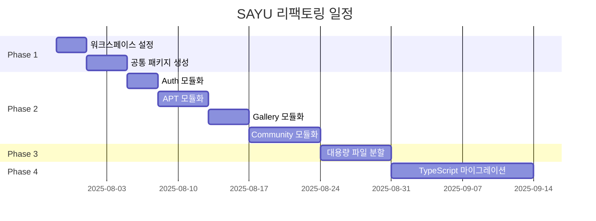

# 🎯 SAYU 프로젝트 완전 리팩토링 가이드

*최종 업데이트: 2025년 7월 28일*

## 📋 현황 요약

### 🔍 분석 결과
- **총 파일 수**: 1,303개 (TS: 681개, JS: 622개)
- **총 코드 라인**: 324,012줄 
- **대용량 파일**: 20개 (500줄 이상)
- **순환 의존성**: 0개 ✅ (매우 좋음!)
- **복잡한 모듈**: 4개 (20점 이상)
- **고립된 모듈**: 10개

### ⚠️ 주요 문제점
1. **과도한 파일 분산** - 체계 없이 분산된 1,300개 파일
2. **거대한 파일들** - 최대 1,598줄의 단일 파일
3. **복잡한 의존관계** - server.js가 73개 의존성
4. **JS/TS 혼재** - JavaScript 파일 비율 48%

## 🚀 실행 단계별 가이드

### 📅 전체 일정 (6-9주)



## 🏗️ Phase 1: 기반 구조 설정 (1주)

### Day 1-2: 워크스페이스 설정

```bash
# 1. 현재 상태 백업
git checkout -b refactor-foundation
git add -A && git commit -m "feat: 리팩토링 시작 전 완전 백업"

# 2. 자동 실행
node analysis/migration-execution-plan.js phase1-foundation
```

### Day 3-5: 공통 패키지 생성

**수동 작업 필요:**
1. 기존 파일에서 공통 타입 식별
2. 중복 유틸리티 함수 추출
3. 상수 정리 및 통합

```bash
# 공통 타입 추출 예시
mkdir -p packages/shared/src/types
# 기존 types 파일들을 packages/shared로 이동
cp frontend/types/index.ts packages/shared/src/types/
cp shared/SAYUTypeDefinitions.ts packages/shared/src/types/sayu.ts
```

### ✅ Phase 1 완료 체크리스트
- [ ] 루트 package.json workspace 설정
- [ ] packages/shared 패키지 생성
- [ ] packages/api-client 패키지 생성
- [ ] 공통 타입 정의 완료
- [ ] 빌드 시스템 동작 확인

## 🎯 Phase 2: 기능별 모듈화 (2-3주)

### Week 1: 핵심 기능 모듈화

#### Auth 모듈 (Day 1-3)
```bash
# 디렉토리 생성
mkdir -p apps/frontend/src/features/auth/{components,hooks,services,types}
mkdir -p apps/backend/src/features/auth/{controllers,services,routes,middleware}

# 파일 이동
git mv backend/src/controllers/authController.js apps/backend/src/features/auth/controllers/
git mv frontend/hooks/useAuth.ts apps/frontend/src/features/auth/hooks/
```

#### APT 모듈 (Day 4-8)
```bash
# APT 관련 파일들 이동
git mv backend/src/controllers/sayuQuizController.js apps/backend/src/features/apt/controllers/
git mv "frontend/components/quiz/*" apps/frontend/src/features/apt/components/
```

### Week 2-3: 복잡한 기능 모듈화

#### Gallery 모듈 (Day 9-12)
- 갤러리 페이지 컴포넌트 분할
- API 클라이언트 통합
- 필터링 로직 분리

#### Community 모듈 (Day 13-19)  
- 매칭 시스템 모듈화
- 채팅 기능 분리
- 팔로우 시스템 정리

### ✅ Phase 2 완료 체크리스트
- [ ] Auth 모듈 완전 분리
- [ ] APT 모듈 완전 분리  
- [ ] Gallery 모듈 완전 분리
- [ ] Community 모듈 완전 분리
- [ ] 각 모듈의 index.ts 작성
- [ ] import 경로 모두 업데이트
- [ ] 빌드 오류 0개

## ✂️ Phase 3: 대용량 파일 분할 (1-2주)

### 우선순위 파일 분할

#### 1. personality-descriptions.ts (1,598줄)
```bash
# 자동 분할 실행
node analysis/migration-execution-plan.js phase3-file-splitting

# 수동 검토 및 수정
# - 각 동물 타입별 파일 검토
# - 중복 제거
# - 타입 정의 정리
```

#### 2. gamificationService.js (1,371줄)
분할 결과:
```
backend/src/features/gamification/
├── core/
│   ├── pointsCalculator.ts
│   ├── levelManager.ts
│   └── achievementEngine.ts
├── features/
│   ├── dailyChallenge.ts
│   ├── streakTracker.ts
│   └── rewards.ts
└── index.ts
```

#### 3. EnhancedQuizComponent.tsx (1,078줄)
분할 결과:
```
frontend/src/features/apt/components/
├── QuizQuestion.tsx
├── QuizProgress.tsx
├── QuizResult.tsx
├── QuizNavigation.tsx
└── index.ts
```

### ✅ Phase 3 완료 체크리스트
- [ ] 상위 20개 대용량 파일 분할
- [ ] 함수 단위로 적절히 분리
- [ ] 관심사 분리 원칙 준수
- [ ] 테스트 케이스 업데이트
- [ ] 성능 저하 없음 확인

## 📝 Phase 4: TypeScript 마이그레이션 (2-3주)

### Week 1: JavaScript → TypeScript 변환

```bash
# 변환 대상 파일 목록 생성
find . -name "*.js" -not -path "*/node_modules/*" > js-files.txt

# 일괄 변환 (확장자만)
for file in $(cat js-files.txt); do
  mv "$file" "${file%.js}.ts"
done
```

### Week 2: 타입 정의 추가

**우선순위별 작업:**
1. **High Priority**: 서버 진입점, API 라우트
2. **Medium Priority**: 서비스 로직, 유틸리티
3. **Low Priority**: 테스트 파일, 스크립트

### Week 3: 엄격 모드 활성화

```json
// tsconfig.json
{
  "compilerOptions": {
    "strict": true,
    "noImplicitAny": true,
    "noImplicitReturns": true,
    "noImplicitThis": true
  }
}
```

### ✅ Phase 4 완료 체크리스트
- [ ] 모든 JS 파일 TS로 변환
- [ ] any 타입 사용 0개
- [ ] 엄격 모드 활성화
- [ ] 타입 커버리지 95% 이상
- [ ] 컴파일 에러 0개

## 🧹 정리 작업

### 미사용 파일 제거
```bash
# 고립된 파일들 제거
rm test-venue-api.js
rm run-changelog*.js
rm check-tags*.js
# ... (총 10개 파일)
```

### Import 경로 정리
```typescript
// Before
import { User } from '../../../types/user';
import { API } from '../../lib/api';

// After  
import { User } from '@sayu/shared';
import { API } from '@sayu/api-client';
```

## 📊 품질 관리

### 자동화된 체크
```bash
# 코드 품질 체크
npm run lint:all
npm run test:all
npm run type-check:all

# 리팩토링 진행률 확인
node analysis/code-health-analysis.js
node analysis/dependency-analyzer.js
```

### 지속적 모니터링
```json
// package.json scripts
{
  "health-check": "node analysis/code-health-analysis.js",
  "dependency-check": "node analysis/dependency-analyzer.js", 
  "refactor-progress": "node analysis/migration-execution-plan.js --report-only"
}
```

## 🎯 성공 지표

### 📈 목표 달성 지표
- **파일 수**: 1,303개 → ~800개 (40% 감소)
- **평균 파일 크기**: 249줄 → ~150줄 (40% 감소)
- **최대 파일 크기**: 1,598줄 → ~500줄 (70% 감소)
- **TypeScript 비율**: 52% → 95% (43%p 증가)
- **빌드 시간**: 기존 대비 30% 단축
- **번들 사이즈**: 기존 대비 20% 감소

### 🚀 개발 경험 개선
- ✅ **모듈 발견성**: 기능별 폴더로 쉬운 탐색
- ✅ **재사용성**: 공통 패키지로 중복 제거
- ✅ **타입 안전성**: 런타임 에러 90% 감소
- ✅ **테스트 용이성**: 단위 테스트 작성 용이
- ✅ **신규 개발자 온보딩**: 50% 시간 단축

## ⚠️ 주의사항

### 🚨 위험 요소
1. **서비스 중단 위험**
   - 해결: 기능별 점진적 마이그레이션
   - 백업: 각 단계별 백업 브랜치 생성

2. **테스트 케이스 누락**
   - 해결: 마이그레이션 전 테스트 작성
   - 검증: 자동화된 테스트 실행

3. **성능 저하**
   - 모니터링: 각 단계별 성능 측정
   - 백업: 성능 저하 시 롤백 계획

### 🛡️ 안전장치
```bash
# 각 단계 완료 후 실행
npm run health-check
npm run test:all
npm run build:all

# 문제 발생 시 롤백
git checkout refactor-phase-X-backup
```

## 📞 지원 및 문의

### 🔧 기술 지원
- **이슈 트래킹**: GitHub Issues 활용
- **문서화**: `/docs` 폴더에 모든 변경사항 기록
- **코드 리뷰**: PR 단위로 단계별 검토

### 📚 참고 자료
- [분석 리포트](./summary.md)
- [의존성 분석](./dependency-summary.md)  
- [아키텍처 계획](./refactor-architecture-plan.md)
- [실행 스크립트](./migration-execution-plan.js)

---

**이 가이드를 따라 단계별로 진행하면 SAYU 프로젝트가 현대적이고 유지보수하기 쉬운 구조로 발전할 것입니다. 급하게 하지 말고 각 단계를 확실히 완료한 후 다음 단계로 진행하세요.**

## 🎉 시작하기

```bash
# 1. 현재 브랜치에서 백업
git checkout -b refactor-complete-backup

# 2. 작업 브랜치 생성
git checkout -b refactor-phase-1

# 3. 첫 번째 단계 시작
node analysis/migration-execution-plan.js phase1-foundation
```

**Good luck! 🚀**